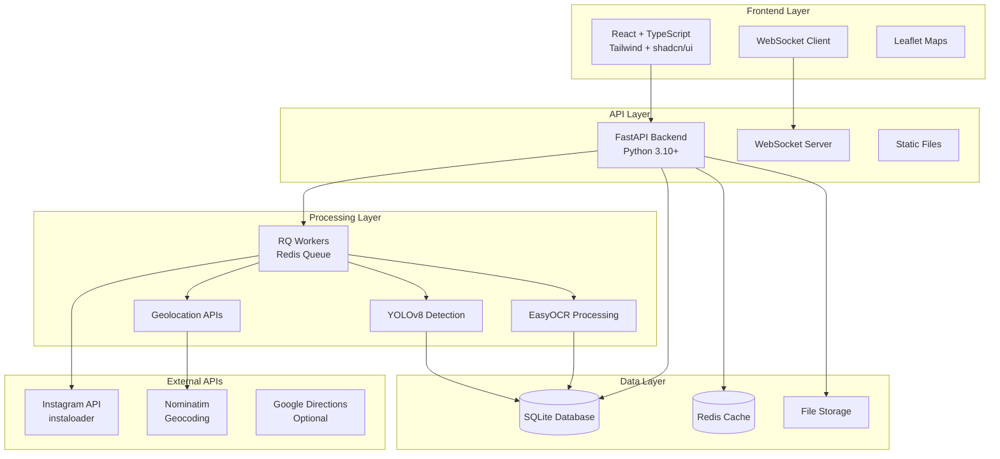

# AccidentAlert 🚨

**AI-Powered Accident Detection and Analysis System**

AccidentAlert is a production-ready full-stack application that automatically detects and analyzes road accidents from social media images using computer vision, OCR, and geolocation technologies. Built for hackathons but designed with production-grade architecture.


## 🚀 Quick Start

### One-Command Setup
```bash
# Clone and start the entire stack
git clone <repository-url>
cd how-i-met-your-coder
cp .env.example .env
docker-compose up --build
```

**Access the application:**
- 🌐 **Frontend**: http://localhost:3000
- 🔧 **API Documentation**: http://localhost:8000/docs
- 📊 **API Health**: http://localhost:8000/health

## 📋 Table of Contents

- [Features](#features)
- [Architecture](#architecture)
- [Setup & Installation](#setup--installation)
- [Development](#development)
- [API Documentation](#api-documentation)
- [Security & Privacy](#security--privacy)
- [Production Deployment](#production-deployment)
- [Troubleshooting](#troubleshooting)
- [Contributing](#contributing)

## ✨ Features

### 🤖 **AI-Powered Analysis**
- **YOLOv8 Object Detection**: Real-time vehicle, debris, and accident detection
- **OCR Text Extraction**: EasyOCR for sign and location text recognition
- **Damage Classification**: Heuristic-based accident severity assessment
- **PII Protection**: Automatic face and license plate blurring

### 🗺️ **Geolocation & Mapping**
- **Smart Location Detection**: Combines OCR geocoding with optional NetVLAD
- **Electronic City Focus**: Optimized for Bangalore's Electronic City area
- **Interactive Maps**: React Leaflet with clustered incident markers
- **Real-time Updates**: WebSocket-powered live incident feed

### 📱 **Social Media Integration**
- **Instagram Scraper**: Automated hashtag monitoring with `instaloader`
- **Ethical Scraping**: Rate-limited, respectful API usage
- **Duplicate Detection**: Perceptual hashing (pHash) prevents reprocessing
- **Content Filtering**: Smart relevance detection for accident-related posts

### 👥 **Human-in-the-Loop Workflow**
- **Review Queue**: Low-confidence incidents flagged for human review
- **Bulk Actions**: Efficient approve/reject workflows
- **Location Correction**: Manual geolocation adjustment interface
- **Audit Trail**: Complete review history and provenance tracking

### 🎨 **Modern UI/UX**
- **React + TypeScript**: Type-safe, component-based architecture
- **Tailwind CSS**: Custom design system with teal-cyan primary (#0EA5A4)
- **Framer Motion**: Smooth animations and micro-interactions
- **shadcn/ui**: Accessible, beautiful component library
- **Responsive Design**: Mobile-first, accessible interface

## 🏗️ Architecture



### Core Components

**Backend (FastAPI + Python)**
- `main.py` - FastAPI application with WebSocket support
- `api/` - REST API endpoints (analyze, scrape, review)
- `utils/` - AI processing modules (YOLO, OCR, PII, geolocation)
- `workers/` - Background job processors using RQ + Redis

**Frontend (React + TypeScript)**
- `pages/` - Main application pages (Dashboard, Scraper, Review)
- `components/` - Reusable UI components
- `hooks/` - Custom React hooks for API and WebSocket
- `lib/` - Utilities and API clients

**Worker System (RQ + Redis)**
- `scrapers/` - Instagram and other social media scrapers
- `processor.py` - Main image analysis pipeline
- Queue management with priority levels

## 🛠️ Setup & Installation

### Prerequisites

- **Docker & Docker Compose** (recommended)
- **Python 3.10+** (for local development)
- **Node.js 18+** (for frontend development)
- **Redis** (for job queuing)

### Option 1: Docker (Recommended)

```bash
# 1. Clone repository
git clone <repository-url>
cd how-i-met-your-coder

# 2. Copy environment configuration
cp .env.example .env

# 3. Start all services
docker-compose up --build

# 4. Access the application
open http://localhost:3000
```

### Option 2: Local Development

```bash
# 1. Backend setup
cd backend
python -m venv venv
source venv/bin/activate  # On Windows: venv\Scripts\activate
pip install -r requirements.txt

# 2. Start Redis (required for workers)
redis-server

# 3. Start backend services
python main.py          # API server (terminal 1)
python workers/processor.py  # Background worker (terminal 2)

# 4. Frontend setup
cd ../frontend
npm install
npm run dev

# 5. Access the application
open http://localhost:3000
```

## 🔧 Development

### Backend Development

```bash
# Install dependencies
cd backend
pip install -r requirements.txt

# Run tests
python -m pytest tests/ -v

# Start development server with hot reload
python -m uvicorn main:app --reload --host 0.0.0.0 --port 8000

# Run worker for background processing
python workers/processor.py

# Check queue statistics
python workers/processor.py --stats
```

### Frontend Development

```bash
# Install dependencies
cd frontend
npm install

# Start development server
npm run dev

# Run linting
npm run lint

# Type checking
npm run type-check

# Build for production
npm run build
```

## 📚 API Documentation

### Core Endpoints

| Endpoint | Method | Description |
|----------|--------|-------------|
| `/` | GET | API health and information |
| `/api/feed` | GET | Paginated incident feed |
| `/api/submit` | POST | Submit image for analysis |
| `/api/analysis/{id}` | GET | Get analysis results |
| `/api/scrape/start` | POST | Start hashtag scraping |
| `/api/scrape/status` | GET | Scraper status and statistics |
| `/api/review/queue` | GET | Review queue for human moderation |
| `/api/review/{id}/approve` | POST | Approve reviewed incident |
| `/api/metrics` | GET | System metrics and statistics |

## 🔒 Security & Privacy

### Privacy Protection

- **No License Plate Storage**: Only bounding boxes and readability scores stored
- **Face Blurring**: Automatic face detection and blurring in public thumbnails
- **PII Redaction**: Sensitive regions masked before public display
- **Review-Only Access**: Original unmasked images only for authorized reviewers

### Legal & Ethical Considerations

⚠️ **Instagram Scraping Warning**: 
- Respect Instagram's Terms of Service
- Use ethical scraping practices (rate limiting, public content only)
- Consider legal implications in your jurisdiction
- Implement proper consent and data retention policies

## 🐛 Troubleshooting

### Common Issues

**1. YOLO Model Download Fails**
```bash
# Manual download
mkdir -p models
wget -O models/yolov8n.pt https://github.com/ultralytics/assets/releases/download/v0.0.0/yolov8n.pt
```

**2. Worker Not Processing Jobs**
```bash
# Check Redis connection
docker-compose exec redis redis-cli ping

# View worker logs
docker-compose logs worker
```

## 🤝 Contributing

### Development Setup

```bash
# 1. Fork the repository
git clone https://github.com/your-username/accidentalert.git

# 2. Create feature branch
git checkout -b feature/amazing-feature

# 3. Make changes and test
npm run test        # Frontend tests
pytest backend/tests/  # Backend tests

# 4. Commit changes
git commit -m "Add amazing feature"
git push origin feature/amazing-feature

# 5. Create Pull Request
```

## 📄 License

This project is licensed under the MIT License.

## 🙏 Acknowledgments

- **YOLOv8**: Ultralytics for state-of-the-art object detection
- **EasyOCR**: JaidedAI for robust OCR capabilities  
- **Instaloader**: For ethical Instagram data access
- **React Leaflet**: For beautiful interactive maps
- **shadcn/ui**: For accessible UI components
- **FastAPI**: For high-performance Python APIs

---

**⚠️ Disclaimer**: This software is for educational and demonstration purposes. Users are responsible for complying with all applicable laws and terms of service when scraping social media content.

## 🚀 Production Deployment on Render

This repository includes a Render blueprint (render.yaml) that provisions everything:
- Redis (for RQ queues)
- PostgreSQL
- Backend API (Dockerized for system dependencies and YOLO weights)
- Worker (Dockerized)
- Frontend static site (minimal landing page served from frontend/public)

### One-time setup
1. Push your repo to GitHub (public or private).
2. Ensure the following files are present (already in this repo):
   - render.yaml
   - backend/docker/Dockerfile (downloads YOLO weights and installs system libs)
   - worker/Dockerfile
   - frontend/public/index.html (minimal landing page)

### Deploy via Blueprint
1. Sign in to Render → New → Blueprint.
2. Select your GitHub repo (how-i-met-your-coder).
3. Review services and click “Apply”. Render will provision all services.

### Environment configuration
- Backend service automatically gets DATABASE_URL and REDIS_URL from the managed services.
- CORS: Set ALLOWED_ORIGINS on the backend service to your frontend URL (comma-separated if multiple). Example:
  - ALLOWED_ORIGINS = https://accidentalert-frontend.onrender.com
- You can also set FRONTEND_ORIGIN instead of ALLOWED_ORIGINS for a single origin.

### Service names and URLs
- By default, Render gives URLs like:
  - Frontend: https://accidentalert-frontend.onrender.com
  - Backend: https://accidentalert-backend.onrender.com
- The minimal landing page links to the backend by replacing “frontend” with “backend” in the hostname. If you rename services, update frontend/public/index.html accordingly.

### Zero-downtime updates
- Push to main: Render auto-deploys (autoDeploy is enabled in render.yaml).
- You can scale instances and switch plans from each service’s Settings page.

### Notes
- Backend and worker run on Docker to ensure heavy deps (OpenCV, PyTorch, EasyOCR) and YOLO weights are available.
- If you need GPU or larger instances, change plan in render.yaml or via the UI after first deploy.
